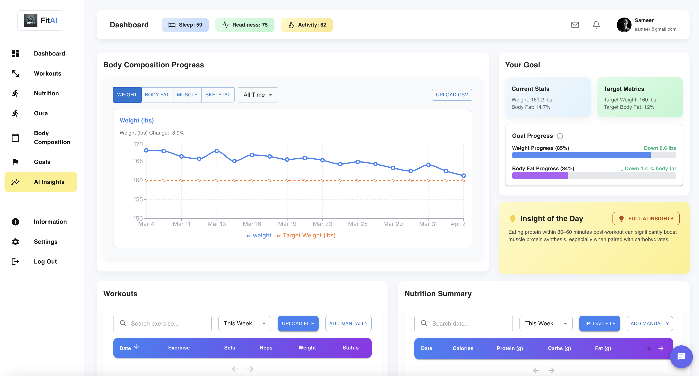

# FitAI – Your Personalized AI Fitness Coach 🧠💪



FitAI is an AI-powered fitness app that integrates body composition, nutrition, and workout data into a personalized dashboard. It uses large language models (LLMs) to generate weekly insights, track your progress, and help you reach your goals with visual and interactive tools.

---

## 🔧 Project Structure

- **`app/`** – FastAPI backend  
  - Handles CSV uploads, stores body composition, workout, and nutrition data
  - Generates weekly reports using LLMs (OpenAI API)
  - Provides endpoints for frontend queries and AI chat assistant

- **`frontend/`** – React dashboard (built with Vite + MUI)  
  - Displays visualizations (charts, tables, macro rings)
  - Responsive, modern UI with animated goal tracking
  - Includes chat assistant, insight cards, and data upload tools

---

## 💡 Key Features

- 📈 **Body Composition Chart** with filters and trend visualization  
- 🥗 **Nutrition Tracking** with macro breakdown and daily progress rings  
- 🏋️ **Workout Log** table with date, exercise, and reps/weight  
- 🎯 **GoalBox** showing live progress toward your target weight and body fat  
- 🧠 **AI Insight Card** with daily advice and weekly summary  
- 💬 **AI Coach Chat** that answers personalized fitness questions

---

## 📦 Tech Stack

- **Frontend**: React, Vite, Material UI  
- **Backend**: FastAPI, SQLModel, OpenAI API  
- **Database**: SQLite (for local prototyping)  
- **Deployment**: TBD (can be hosted on Render, Vercel, or Dockerized)

---

## 🚀 Getting Started

Clone the repo:

```bash
git clone https://github.com/your-username/fitai.git
cd fitai

